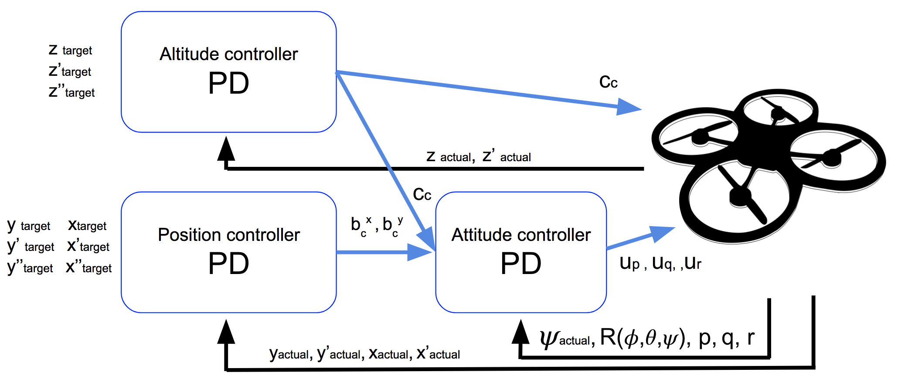

# The C++ Project Readme #

This is the writeup for the C++ project.  Below are the architecture diagrams for the quadcoptor controller that I implemented in this project. 



This is the detailed architecture diagram of the attitude controller.


## Implemented Motor Commands in C++ ##

I calculated the thrust per rotor based on the total given thrust and momentum and use the calculated values to update the cmd.desiredThrustsN array.

```
    float l = L / sqrtf(2.f);
    float t1 = momentCmd.x / l;
    float t2 = momentCmd.y / l;
    float t3 = -momentCmd.z / kappa;
    float t4 = collThrustCmd;

    cmd.desiredThrustsN[0] = (t1 + t2 + t3 + t4) / 4.f;  // front left  
    cmd.desiredThrustsN[1] = (-t1 + t2 - t3 + t4) / 4.f; // front right 
    cmd.desiredThrustsN[2] = (t1 - t2 - t3 + t4) / 4.f; // rear left   
    cmd.desiredThrustsN[3] = (-t1 - t2 + t3 + t4) / 4.f; // rear right 
```

## Implemented body rate control in C++ ##

The controller is a proportional controller on body rates to commanded moments. The controller takes into account the moments of inertia of the drone when calculating the commanded moments. I use the desired and actual pqr values to calculate the pqr error and use that error calculation along with the inertia and kpPQR constants to calculate the desired moment. After implementing the body rate control function we tuned the kpPQR constant to achieve success in scenario 2 Body Rate and Roll/Pitch.

```
  V3F pqr_error = pqrCmd - pqr;
  momentCmd = kpPQR * V3F(Ixx, Iyy, Izz) * pqr_error;
```

## Implement roll pitch control in C++ ##

The controller uses the acceleration and thrust commands, in addition to the vehicle attitude to output a body rate command. The controller accounts for the non-linear transformation from local accelerations to body rates. Note that I utilize the drone's mass when calculating the target angles. The algorithm is provided with the desired acceleration in global coordinates, the estimated attitude and desired collective thrust. The algorithm returns the calculated desired pitch and roll rates of the quadcopter. Following the implementation of this algorithm the kpBank constant is tuned to pass the scneario 2.

```
  if (collThrustCmd > 0) {
      float c_d = -collThrustCmd / mass;
      float b_x_cmd = CONSTRAIN(accelCmd.x / c_d, -maxTiltAngle, maxTiltAngle);
      float b_x_err = b_x_cmd - R(0, 2);
      float b_x_p_term = kpBank * b_x_err;

      float b_y_cmd = CONSTRAIN(accelCmd.y / c_d, -maxTiltAngle, maxTiltAngle);
      float b_y_err = b_y_cmd - R(1, 2);
      float b_y_p_term = kpBank * b_y_err;

      pqrCmd.x = (R(1, 0) * b_x_p_term - R(0, 0) * b_y_p_term) / R(2, 2);
      pqrCmd.y = (R(1, 1) * b_x_p_term - R(0, 1) * b_y_p_term) / R(2, 2);
  }
  else {
      pqrCmd.x = 0.0;
      pqrCmd.y = 0.0;
  }
```

## Implement altitude controller in C++ ##

The controller uses both the down position and the down velocity to command thrust. Accounting for the drone's mass the algorithm outputs the collective thrust command from the provided desired and current positions in NED coordinates, feed-forward vertical acceleration and teh time-step.  This algorithm is used in conjunction with the next 2 functions for scenario 3 test.  The parameters that need tuning for the altitude controller are kpPosZ adn kpVelZ.

```
  float z_err = posZCmd - posZ;
  integratedAltitudeError += z_err * dt;
  float vel_z_err = CONSTRAIN(velZCmd, -maxAscentRate, maxDescentRate) - velZ;
  float bZ = R(2, 2);

  float pTerm = kpPosZ * z_err;
  float dTerm = kpVelZ * vel_z_err;
  float iTerm = KiPosZ * integratedAltitudeError;
  float u1Bar = pTerm + iTerm + dTerm + accelZCmd;

  float thrustAcc = (u1Bar - CONST_GRAVITY) / bZ;
  thrust = -thrustAcc * mass;
```


## Implement lateral position control in C++ ##

The controller uses the local NE position and velocity to generate a commanded local acceleration.  The algorithm is provided the current position and velocity as well as the desired position and velocity as well as the feed-forward acceleration.  I use the input parameters to calculate the position and velocity error, with the error calculations and the tuned parameters we update the acceleration command wit the local acceleration.  The parameters need tuning for scenario 3 that are associated with the lateral position controller are kpPosXY and kpVelXY.  

```
  V3F pos_err = posCmd - pos;
  if (velCmd.mag() > maxSpeedXY) {
      velCmd = velCmd.norm() * maxSpeedXY;
  }
  V3F vel_err = velCmd - vel;
  accelCmd = kpPosXY * pos_err + kpVelXY * vel_err + accelCmd;
  if (accelCmd.mag() > maxAccelXY) {
      accelCmd = accelCmd.norm() * maxAccelXY;
  }
```

## Implement yaw control in C++ ##

The controller uses a linear/proportional heading controller to yaw rate commands.  The algorithm calculates the yaw rate from the provided current anc commanded yaws.  The Algorithm calculates the yaw error and uses that error along with the constant kpYaw, that must also be tuned, to update the yaw rate command.  Scenario 3 tests this function.

```
  float yaw_err = yawCmd - yaw;
  yawRateCmd = kpYaw * yaw_err;
```

## Flight Evaluation ##

In each scenario the drone looks stable and performs the required tasks. Below are the scenario results. My parameter file is below.

```
############################## SLR SIMPLECONFIG ############################
# this is a comment. [X] is a namespace. [X:Y] initializes X from Y
# Namespace and parameter names are not case-sensitive
# X=Y sets X to Y. Y may be a string, float, or list of 3 floats
############################################################################

[QuadControlParams] 

UseIdealEstimator=1

# Physical properties
Mass = 0.5
L = 0.17
Ixx = 0.0023
Iyy = 0.0023
Izz = 0.0046
kappa = 0.016
minMotorThrust = .1
maxMotorThrust = 4.5

# Position control gains
kpPosXY = 26
kpPosZ = 34
KiPosZ = 20

# Velocity control gains
kpVelXY = 12
kpVelZ = 9

# Angle control gains
kpBank = 12
kpYaw = 4

# Angle rate gains
kpPQR = 90, 90, 6

# limits
maxAscentRate = 5
maxDescentRate = 2
maxSpeedXY = 5
maxHorizAccel = 12
maxTiltAngle = .7
```


### Scenario Intro 1 ###


```
SIMULATOR!
Select main window to interact with keyboard/mouse:
LEFT DRAG / X+LEFT DRAG / Z+LEFT DRAG = rotate, pan, zoom camera
W/S/UP/LEFT/DOWN/RIGHT - apply force
C - clear all graphs
R - reset simulation
Space - pause simulation
Simulation #1 (../config/1_Intro.txt)
Simulation #2 (../config/1_Intro.txt)
PASS: ABS(Quad.PosFollowErr) was less than 0.500000 for at least 0.800000 seconds
Simulation #3 (../config/1_Intro.txt)
PASS: ABS(Quad.PosFollowErr) was less than 0.500000 for at least 0.800000 seconds
```


### Scenario Intro 2 ###

### Scenario Intro 3 ###

### Scenario Intro 4 ###

### Scenario Intro 5 ###